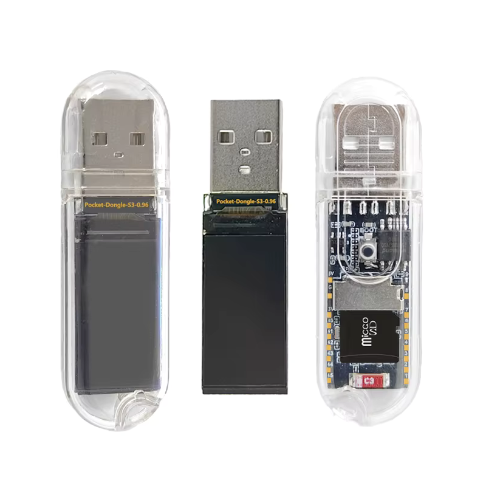

# ESP32-S3 Pocket Dongle

> Universal pendrive - USB Storage/BLE receiver/tamagotchi

---

## Table of contents

- [TFT pins](#tft)
- [SD Card pins](#sd-card)
- [To do](#todo)

---

## TFT pins

#define TFT_SCLK 10  
#define TFT_MOSI 11  
#define TFT_CS   12  
#define TFT_DC   13  
#define TFT_RST  14  

## SD card pins

#define SD_MISO 16  
#define SD_MOSI 18  
#define SD_SCK  17  
#define SD_CS   47  

---

## Done

- [ ] Nice sine bootload animation
- [ ] Basic menu with coloring
- [ ] SD handling
- [ ] USB Storage
- [ ] Screen rotation
- [ ] Tamagotchi thing
- [ ] BLE receiver for keyboard
- [ ] BLE receiver for anything
- [ ] Saved BLE devices

---

## To do

- [ ] HID as keyboard/mouse (scripts)
- [ ] Some WiFi??
- [ ] 2FA key

---

## License

This project is licensed under the MIT License.
